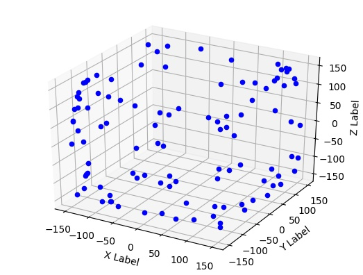

# convex-hull
Convex hull of given 3D points

# Usage
Use **hull.py** to generate the output which will be stored inside data folder.
Use **plot.py** to generate the 3D plot of the points that are in the hull.

# Description

