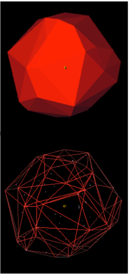

# convex-hull
Convex hull of given 3D points

Wikipedia [page](https://en.wikipedia.org/wiki/Convex_hull)

source Wikipedia

# Method

There is a method named [Quickhull](https://en.wikipedia.org/wiki/Quickhull). The steps are mentioned in the wikipedia page.

I have used this [blog](http://thomasdiewald.com/blog/?p=1888) to understand the algorithm and implemented it myself.

# Algorithm

The main steps are as follows.

1) Make the initial tetrahedron which will serve as base.
	For this initially calculate the maximum and minimum points on all the axes.
	From this choose the 2 most farthest point and join a line.
	Then find the point with maximum distance from this line and make a triangle.
	Then find most distant point from this plane and make a tetrahedron.

2) Then divide the points to the 4 faces of the tetrahedron so that the points are outside of each faces. This can be done by taking dot product of the clockwise normal of the plane to the the line joining any vertex of the plane and the point.

3) If the distance is positive add the point to the to_do list of the vertex and remove it from the original list of the problem.

4) After doing this for all the 4 faces if the points that are still in the original list are the points which are inside the tetrahedron so neglet them. This process will be used in subsequent steps to eliminate the internal points.

5) After this we need to continue the program till there is a face of the polytope who have non-zero to_do list.

6) For every face find the most distant point by step 2 and 3. Then we need to find the horizon of this point i.e – the vertices to which this point will connect.

7) A DFS from the face to which the point was a to_do list point. The continuation of the DFS depends on either the point in consideration is to_do list of the face. This will give me the final set of edges which are the horizon set.

8) The other vertices of the to_do list needs to be re assigned to the new faces of the cone that is made.

9) Do this for all the faces till any points are left.

# Usage
Use **hull.py** to generate the output which will be stored inside data folder.

    python hull.py <name of input file>

Use **plot.py** to generate the 3D plot of the points that are in the hull.

    python plot.py <name of input file>

# Description
The figure generated from plot.py is interactive and can be rotated in any direction to look into the details of the points.

The picture shown here is just a snapshot of the figure generated.

# Support
In case you are using the code or you liked this repository please show your support by giving it a star :)
